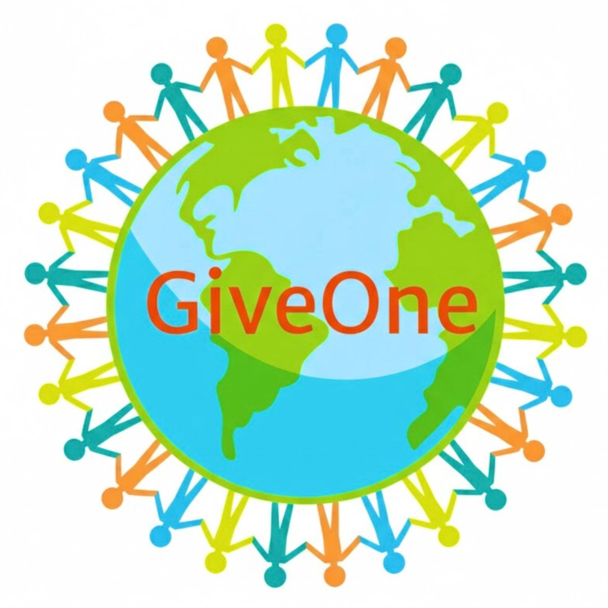

# GiveOne: The Universal Blueprint for Collective Power

"If adopted by everyone, we can end suffering and create happiness around the world. We are all connected."

In our mission at **The Aura Impact**, we believe true innovation happens when technology elevates humanity. While the **Golden Runway** provides an Innovation Warranty for employers and **Liquid Cash 24** provides a Sovereign Standard for individuals stability, **GiveOne** is a decentralized, self-commitment framework for direct giving, dedicating 1% of earnings and 1% of time to empower those in need and protect nature. Everyone need a helping hand at some point of time in their life. GiveOne is a powerful human chain of holding hands around the world. 

GiveOne is a self-commitment model that creates a global support system for everyone in need & Nature, ensuring that as we advance, we do not leave anyone or our planet behind.

---

## 📖 The Core Pledge
**#GiveOne**
Let's donate 1% of what we earn and 1% of our time to help those in need & Nature. Make a difference. We are all connected.

* **A Self-Commitment:** This is a personal dedication for giving by an individual and is not associated with any person or organization.
* **Non-Accumulation:** This framework is not to be used for accumulating funds.
* **The Message:** Share the message by adding the tag #GiveOne whenever you give to motivate others and be blessed by the Law of Nature for Giving.

GiveOne is not an organization that accumulates funds. It is a framework that operates on two simple commitments:

1.  **1% of Earnings:** A self-commitment to give 1% of what you earn to help those in need or environmental causes. Keep 1% aside from every pay you receive and use it when you encounter something that needs a helping hand.
2.  **1% of Time:** A self-commitment to dedicate 1% of your time to direct action, service, or conservation, or a professional giving using your best skills to help.

---

## ⚡ The GiveOne Shift

| The Legacy Way (Charity) | The GiveOne Way (Framework) |
| :--- | :--- |
| ❌ Centralized Funds (High overhead/loss) | ✅ Direct Giving (Self-managed/100% impact) |
| ❌ Occasional Giving (Reactive) | ✅ 1% Lifecycle (Continuous/Systemic) |
| ❌ Financial Only (Passive) | ✅ Time & Resources (Active/SuperHuman) |

---

## 🛡️ The Framework Logic: Why 1%?

### 1. The Power of Numbers
If everyone in a city donates 1% to people in their own city, no one in that city will sleep without a roof or an empty stomach. Food and shelter for all is possible; small donations in large numbers make a massive difference. Most of the time when someone needs help, they just need a temporary support by one helping hand.

### 2. Diversified Impact
A self-committed contribution to bring the change we want to see in the world. Donate to any cause you are interested in:
* Supporting the elderly, the poor, the disabled, or orphans.
* Medical assistance and sponsoring education for the talented.
* Helping animals, the environment, science, and research.
* **Verification:** Ensure every contribution is spent right if not giving directly; see the difference it makes.

### 3. Professional Giving: "Give One Free"
Giving to those who cannot afford can be integrated into your profession:
* **Doctors:** One surgery free for the poor.
* **Restaurant Owners:** One meal free for an elderly person on the street.
* **Store Owners:** One book, one tea, or one dress free from your establishment.
* **Core Principle:** Give one free from what you have.

---

## 🛡️ High-Priority Application: Givers Fund for Employees (GFE)
To launch the GiveOne project, we are addressing a high-priority need for January 2026: supporting individuals impacted by massive corporate layoffs. The GFE is a high-trust, decentralized system designed to continue the current salary of impacted employees until they secure new employment.

### ✈️ First active reachout: The Home Depot (800 Employees)
We are working to establish the GFE system starting with the 800 impacted individuals at The Home Depot due to layoffs on Jan 28th 2026. The goal is to ensure their monthly take-home pay continues without interruption through a community-backed "Givers Fund for Employees."

### ⚙️ The GFE Blueprint (6-Step Execution)
1.  **Institutional Setup:** Create a bank account authorized by the company (e.g., The Home Depot).
2.  **Corporate Announcement:** The company announces the account as a "Givers Fund for Employees" initiated by The Aura Impact. Givers worldwide transfer funds directly to this account.
3.  **Payroll Integration:** Payments are distributed through the company’s existing payroll at the usual frequency and amount. This ensures trust and removes the "disclaimer" risks of personal fund accumulation.
4.  **Awareness & Transparency:** The Aura Impact team uses its channels to reachout for global awareness of the GFE account and hosts a live dashboard tracking funds received and the number of employees currently supported.
5.  **Transition Management:** Once 100% monthly support for the target group (e.g., 800 people) is reached, support continues until each individual secures a new job. GFE bank account created will be closed after all 800 individuals are successfully transitioned to equally happy new job.
6.  **Scaling the Success:** Once the GFE system is successfully established at The Home Depot, it will be scaled to support larger groups, such as the 16,000 employees layoff announcement at Amazon on Jan 28th 2026.

---

## 🚦 Smart Giving & Sustainability 
To ensure the GiveOne framework elevates humanity sustainably:
* **Self-Preservation:** Take care of yourself while giving. Be successful in life to earn more so you can give more; stay strong and healthy so you can donate your time and energy.
* **Innovative Solutions:** Giving models should be brought into the system with sustainable innovative solutions that continue for generations.
* **Global Motivation:** Send videos of your implemented ideas for solving real-world problems. We will publish them to motivate others to replicate those models everywhere.
* **Direct Action:** Give to those in need or nature in a way that you can verify the impact yourself by directly giving to beneficiary.
* **No Accumulation:** The Aura Impact never holds your giving funds. You are the architect of your own 1%.
* **Family Support First:** Supporting an employee means supporting a whole family. Focus on initiatives like GFE that preserve family stability.
* **Nature in Balance:** Your 1% is equally dedicated to the environment to ensure "SuperHuman" progress doesn't come at the cost of the Earth.

---

## 🤝 How to Participate
1.  **Adopt the Blueprint:** Review the principles of the 1% commitment.
2.  **Self-Commit:** Use the Liquid Cash 24 calculator to ensure your own stability, then commit your 1% surplus to the GiveOne framework.
3.  **Support GFE:** When the Givers Fund for Employees accounts are announced for The Home Depot or Amazon, use your 1% time to support a fellow human’s career transition. 

We are actively looking for partners (Banks, Corporations, and Authorities) to turn this visionary concept into a global standard.
* **Financial Institutions:** Help us architect the restricted GFE accounts with JPMorgan Chase or other authorities.
* **Corporate Leaders:** If your company is facing a transition, contact us to implement a GFE for any layoffs planned.
* **Visionaries:** Join us in making the world aware of ‘Givers fund for employees’ (GFE).

**Email:** theauraimpact@gmail.com

---

## 🚀 The Mission: From Earning to Living
The goal is to take this message to every school, university, organization, and home. Growing up with an attitude of giving should be part of the system along with being taught how to earn. 

You enjoy every moment of life while giving just 1%! Let us all hold hands and pledge **#GiveOne** to see our real blissful smile!

---

## 🌐 Connect & Learn
* **YouTube:** [The Aura Impact Channel](https://youtube.com) – Deep dives and explainer videos.
* **LinkedIn:** [The Aura Impact Page](https://linkedin.com) – Corporate announcements and networking.
* **Instagram:** [The Aura Impact](https://instagram.com) – Awareness and community.
* **Website:** [The Aura Impact Platform](https://theauraimpact.com) - Open source collaboration platform.

### ⚠️ Disclaimer
This framework is a self-commitment for giving by an individual and not associated with any person or organization. TheAuraImpact does not collect, hold, or manage charitable funds. All GFE initiatives require formal authorization by the respective companies and must comply with regional financial and employment laws.
